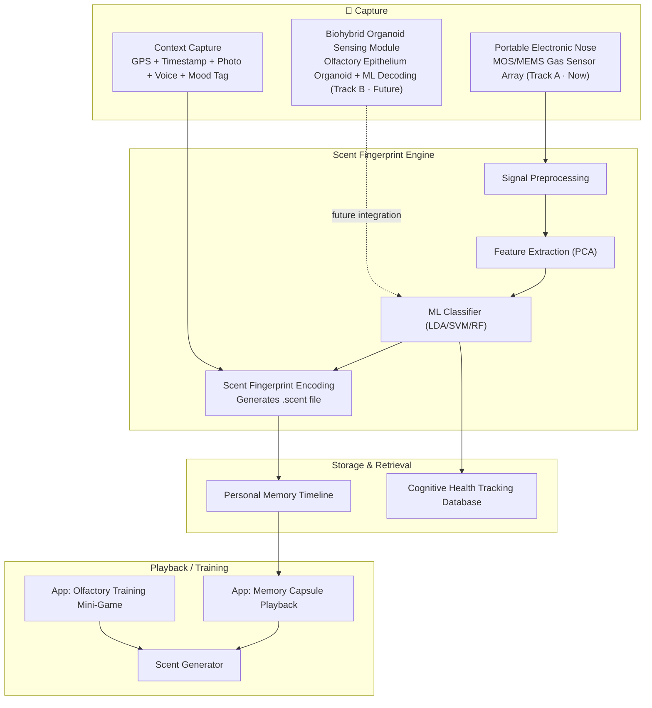

# 🧠 Project PROUST — The Scent Memory Project

### A device that "records" and "replays" smells

> "But at the very instant when the mouthful of tea mixed with cake-crumbs touched my palate, I quivered, attentive to the extraordinary thing that was happening to me..." — Marcel Proust

Exploring smell as the "fifth recordable, replayable memory medium"

---

## What problem are we solving?

We've built cameras for what we *see*, and recorders for what we *hear* — but we've never seriously built a device to record and replay what we *smell*, even though scent may be the memory channel with the **highest emotional intensity and the strongest sense of vividness** [doc1][doc2][doc3].

The olfactory system is the only sensory pathway that bypasses the thalamus entirely, projecting directly to the amygdala (the emotional center) and the hippocampus (the memory center) [doc1][doc2][doc3]. This explains why smell-triggered memories tend to be **more emotional, more distant in time, and more immersive** than those triggered by visual or auditory cues (the so-called "Proust effect"). At the same time, olfactory decline has been shown to be one of the earliest — yet most overlooked — biomarkers of neurodegenerative diseases like Alzheimer's, appearing years before cognitive symptoms [doc6][doc7][doc8][doc9].

**Our insight**: if we can structurally record "what was smelled, where, and with what emotion/imagery," and later reproduce it precisely, we can turn smell from a fleeting, unstorable sensation into a **storable, searchable, therapeutically useful memory medium**.

---

## Three Application Scenarios

| Scenario | Description |
|---|---|
| **Personal Memory Capsules** | Casually capture meaningful scent moments from daily life, and "open" them later with one tap to relive the moment and its associated memories |
| **Reminiscence Therapy & Olfactory Training for Cognitive Decline** | Precision scent-based reminiscence therapy, structured olfactory training, and early-screening support signals for Alzheimer's/MCI patients |
| **Quality-of-Life Support for People with Smell Loss** | Personalized olfactory training and "safe scent" desensitization for people with COVID-related, trauma-related, or age-related smell loss |

---

## System Architecture

---

## Core Scientific Basis at a Glance

| Topic | Key Finding | Source |
|---|---|---|
| Neural mechanism of olfactory memory | Smell bypasses the thalamus and connects directly to the amygdala + hippocampus, making scent memories more emotional and durable | [doc1][doc2][doc3] |
| Early Alzheimer's biomarker | Loss of noradrenergic axons in the olfactory bulb, driven by microglia, causes olfactory dysfunction that precedes cognitive symptoms | [doc6][doc9] |
| Longitudinal blood biomarker evidence | A 15-year cohort study shows higher p-tau217/NfL/GFAP levels correlate with faster olfactory decline | [doc7] |
| Tau pathology spread pathway | Olfactory identification decline tracks the spread of tau pathology from central to peripheral olfactory structures | [doc8] |
| Electronic-nose hardware foundation | A single MEMS pulse-heated sensor combined with machine learning can achieve up to 100% gas classification accuracy | [doc4][doc5] |
| Olfactory epithelium organoids | An accidental 3D culture discovery revealed HBC/GBC stem cells that sustain lifelong olfactory neurogenesis | [doc10][doc11] |
| Biohybrid organoid-robot systems | The world's first closed-loop "sense-decode-act" BOR system, using real olfactory organoids as sensors | [doc13][doc14][doc15] |

Full reference list: [`docs/REFERENCES.md`](docs/REFERENCES.md).

## What This Project Demonstrates （still in progress)

This project is useful as a starter demo for:

- electronic nose concepts
- MEMS/MOS gas sensor array simulations
- synthetic odor fingerprint classification

## Limitations

This is a **toy simulation**, not a real sensor pipeline.

Current limitations:

- uses synthetic data rather than real sensor measurements
- does not model real sensor drift, humidity effects, or hardware noise in detail
- classification task is relatively clean and idealized
- currently implemented as a single script

## Suggested Next Improvements

You could improve the project by adding:

1. real CSV sensor input
2. train/test split with saved datasets
3. confusion matrix and per-class accuracy
4. support for unknown odor classes
5. CLI arguments
6. a small web demo with Streamlit
7. modular code structure such as `src/`, `data/`, and `tests/`

---

## Ethics & Limitations

All "early-screening support" features are explicitly framed as non-diagnostic and would require medical ethics review and clinical validation before any real-world deployment. "Digitally synthesizing" scent currently relies on approximating a scent by blending pre-made fragrance cartridges, rather than molecular-level reconstruction. The biological organoid sensing pathway remains in early laboratory stages, and this repository does not involve any live biological experimentation.

---

## License

This project is released under the [MIT License](LICENSE).
